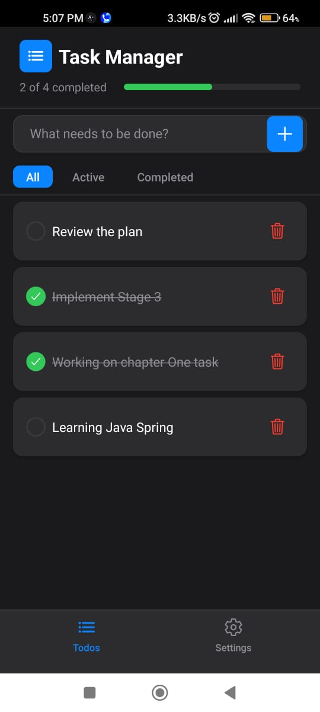
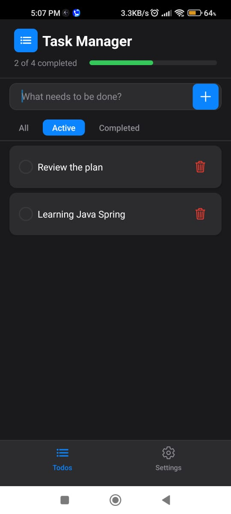
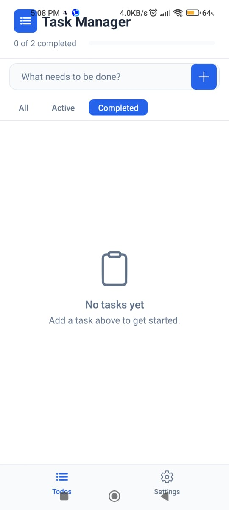
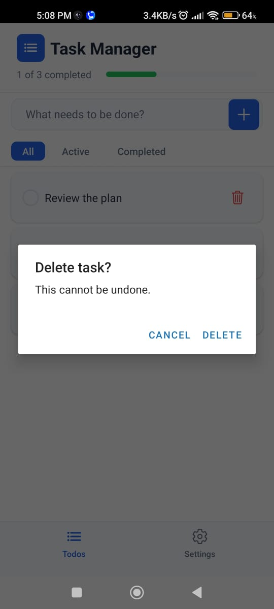
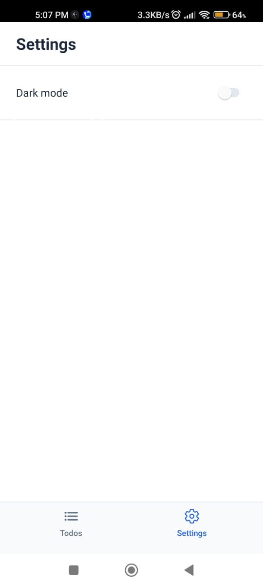

# Task Manager

A React Native (Expo) task manager app for the Chapter One tech screen. Add tasks, mark them complete, delete them, and filter by All / Active / Completed. **Task state is kept in local component state only** (no backend, no persistence, no global state for tasks).

**Contents:** [Features](#features) · [Screenshots](#screenshots) · [Architecture](#architecture-overview) · [How to run](#how-to-run) · [Estimation](#estimation) · [Tech stack](#tech-stack) · [Design decisions](#design-decisions) · [Third-party libraries](#third-party-libraries)

---

## Features

- **Add task** — Rounded input bar + Add (plus) button; empty input is ignored and the field clears after add.
- **Mark complete** — Tap a task to toggle completion; completed tasks show a green checkmark, strikethrough, and muted color.
- **Delete task** — Trash icon on each row with a confirmation dialog (or browser confirm on web) before removing.
- **Task list** — All tasks in a scrollable list with filter tabs: All, Active, Completed. Progress bar shows “X of Y completed.”
- **Empty state** — Message and icon when there are no tasks (or none match the filter).
- **Bottom tab** — **Todos** (task list) and **Settings** (dark/light mode toggle). Task data lives only on the Todos flow; Settings is for UI preference.
- **Dark / light mode** — Toggle in Settings; theme (colors, surfaces) updates across the app. Implemented with a small React Context for UI only; task state remains in the `useTasks` hook.

---

## Screenshots

### Todos screen (dark theme)

| All tasks | Active filter | Completed (empty state) |
|-----------|----------------|---------------------------|
|  |  |  |

- **All** — Full task list with progress bar (“X of Y completed”), checkboxes, and delete icons.
- **Active** — Only uncompleted tasks.
- **Completed** — Only completed tasks; shows empty state when none.

### Delete confirmation

| Dialog |
|--------|
|  |

Tapping the trash icon shows a native confirmation (“Delete task?” / “This cannot be undone.”) with Cancel and Delete before removing the task.

### Settings

| Dark mode toggle |
|------------------|
|  |

Settings screen with Dark mode switch. Theme (dark/light) applies across the app; task list is unchanged when switching tabs.

---

## Architecture overview

- **Screens:** `HomeScreen` (Todos) composes header, progress, `AddTaskInput`, filter tabs, and `TaskList`; `SettingsScreen` holds the dark-mode switch. Both use hooks and pass data/callbacks down.
- **Components:** `TaskList`, `TaskItem`, `AddTaskInput`, `EmptyState` are presentational; they receive props and callbacks (no task state).
- **State:** `useTasks` holds the **tasks array and all CRUD handlers** (add, toggle complete, delete). Task logic is fully local to this hook. `ThemeProvider` holds only UI preference (dark/light) and does not manage tasks.
- **Types:** `Task` and `TaskFilter` in `src/types/task.ts`.
- **Constants:** Theme (dark/light) and copy in `src/constants/` (e.g. `theme.tsx`, `copy.ts`).

---

## How to run

### Prerequisites

- **Node.js 20.19+** (required for Expo SDK 54 and Metro). Check with `node -v`; if you have Node 18, upgrade (e.g. [nodejs.org](https://nodejs.org) LTS or `nvm install 20`).
- **npm** (or yarn).
- **Expo Go** on your phone: use the **latest Expo Go** from the [Play Store](https://play.google.com/store/apps/details?id=host.exp.exponent) (Android) or [App Store](https://apps.apple.com/app/expo-go/id982107779) (iOS). This project uses **Expo SDK 54**; if you see “Project requires a newer version of Expo Go”, update Expo Go to the newest version.

### Step-by-step

1. **Clone and enter the project** (if needed):
   ```bash
   cd chapter-one-assignment
   ```

2. **Install dependencies:**
   ```bash
   npm install
   ```
   (Uses `legacy-peer-deps` via `.npmrc` for test libs; no extra flags needed.)

3. **Start the dev server:**
   ```bash
   npm start
   ```
   A QR code and menu will appear in the terminal.

4. **Open the app:**
   - **Expo Go (phone):** Same Wi‑Fi as your machine → open Expo Go → scan the QR code from the terminal (or from the browser tab Expo opens).
   - **Web:** In the terminal press `w`, or run `npm run web`, then open the URL in a browser.
   - **Android emulator:** Press `a` in the terminal (or `npm run android`).
   - **iOS simulator (macOS only):** Press `i` in the terminal (or `npm run ios`).

5. **Run tests:**
   ```bash
   npm test
   ```
   Runs Jest (useTasks hook + TaskItem component). Uses `jsdom` so React Testing Library’s `renderHook` works; no extra setup needed after `npm install`.

### Useful instructions

- **“Project requires a newer version of Expo Go”** → Update Expo Go to the latest from the store; this project targets SDK 54.
- **“Incompatible SDK version”** → Ensure Expo Go is up to date and you’ve run `npm install` so the project matches SDK 54.
- **Metro / Node errors (e.g. `availableParallelism`)** → Use Node 20.19+ (`node -v`).
- **Web:** Delete uses `window.confirm`; on native it uses `Alert.alert`.

---

## Estimation

| Item | Estimate |
|------|----------|
| **First-time setup** (clone, Node 20+, `npm install`) | ~2–5 min |
| **Start dev server** (`npm start`) | ~10–30 s |
| **Run tests** (`npm test`) | ~5–15 s |
| **Scope** | Single-screen task CRUD + Settings; local state only; no backend or persistence. |

---

## Tech stack

- **React Native** — UI framework
- **Expo** — Tooling, dev server, and native build pipeline
- **TypeScript** — Typing for components, hooks, and utils

---

## Design decisions

- **Local state only for tasks:** Per assignment, task list and CRUD live in `useTasks` (useState + useCallback). No Redux or task-level Context. A separate ThemeProvider is used only for dark/light UI preference.
- **Bottom tab:** Simple two-tab layout (Todos, Settings) for clear navigation; task list and settings stay separate.
- **Delete confirmation:** `Alert` on native and `window.confirm` on web so delete works everywhere.
- **Filter in screen:** Filter state (All/Active/Completed) lives in `HomeScreen`; the list is derived and passed to `TaskList`. The hook stays focused on CRUD.

---

## Third-party libraries

| Library | Purpose |
|--------|---------|
| **expo** | Dev server, native builds, and Expo APIs. Status bar uses React Native’s `StatusBar` (no expo-status-bar) for SDK 54 compatibility. |
| **@expo/vector-icons** | Icons (checkmark, add, trash, list, settings, clipboard) used in UI. |
| **react** | Core UI runtime. |
| **react-native** | Components and APIs for iOS/Android (and web with react-native-web). |
| **react-dom** / **react-native-web** | Web support when running `npm run web`. |
| **typescript** | Static typing and tooling. |
| **jest** / **jest-expo** | Test runner and Expo Jest preset. |
| **@testing-library/react-native** | Component tests (e.g. TaskItem). |
| **@testing-library/react** | `renderHook` for testing `useTasks`. |
